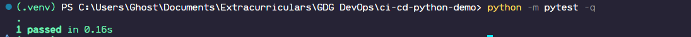

# Captures & Logs

(.venv) PS C:\Users\Ghost\Documents\Extracurriculars\GDG DevOps\ci-cd-python-demo> .venv\Scripts\python -m pytest -q
.                                                                                                               [100%]
1 passed in 0.14s